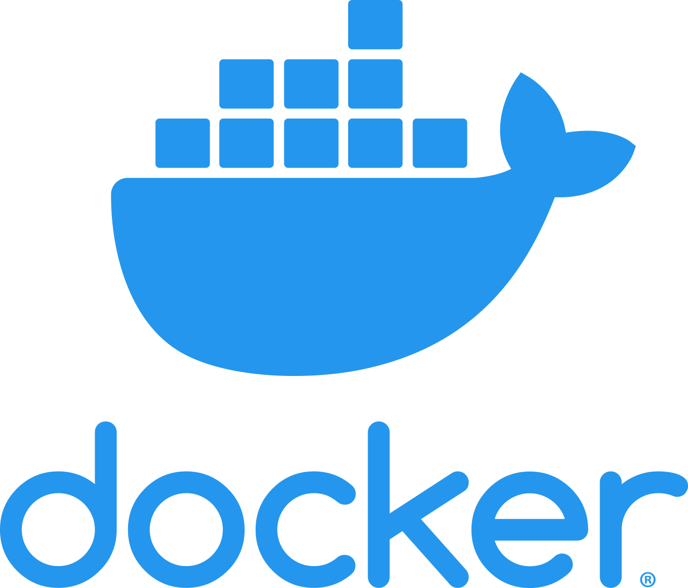

### Hi there, I'm Adir 👋

## A Full-Stack Web Developer!
- 🔭 I’m currently working on a few projects
- 👯 I’m looking for new and exciting projects
- 🥅 I’m using the most modern technologies, approaches, and best practices
- 🌱 I’m learning and reading everyday
- ⚡ Fun fact: I love to play video games

### Languages and Tools:

 
 

---

